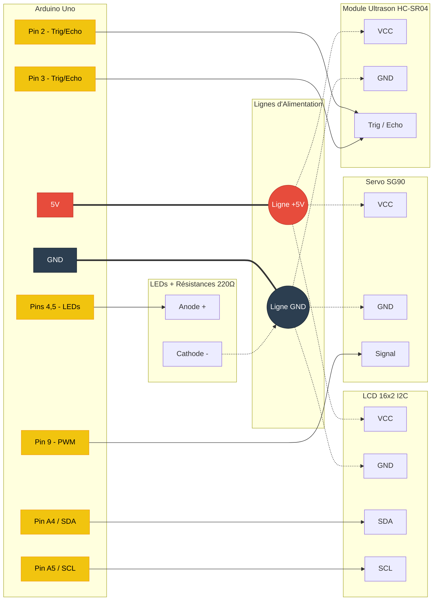

# Your Project Name
Système de Parking Intelligent

|`Author` | Your full name
ARFAOUI HOUSSEM

## Description
Ce projet consiste à concevoir un système de parking automatisé utilisant la carte Arduino Uno. L'objectif est de faciliter la gestion des places de stationnement en temps réel, d'optimiser l'espace et de réduire le temps de recherche pour les conducteurs.

## Motivation
Trouver une place de parking dans des zones denses ou sur un campus universitaire est souvent une source de perte de temps. Ce projet vise à moderniser les infrastructures existantes en automatisant l'accès (via une barrière) et en guidant visuellement les conducteurs. Cela permet de réduire les embouteillages internes, d'améliorer l'expérience utilisateur et de limiter les émissions de CO2 liées à la recherche de stationnement.

## Architecture
Le système utilise l'Arduino Uno comme unité centrale de traitement. À l'entrée, un capteur à ultrasons détecte l'arrivée d'un véhicule, déclenchant l'ouverture de la barrière par le servomoteur. À l'intérieur, des capteurs à ultrasons supplémentaires surveillent l'occupation de chaque place. L'Arduino lit ces données et met à jour l'affichage de l'écran LCD à l'entrée avec le nombre total de places disponibles, tout en changeant l'état des LEDs (vert = libre, rouge = occupé) au-dessus de chaque place.

### Block diagram

```mermaid
graph TD
    %% Définition des styles
    classDef arduino fill:#00979C,stroke:#006468,stroke-width:2px,color:white;
    classDef sensor fill:#F39C12,stroke:#E67E22,stroke-width:2px,color:white;
    classDef actuator fill:#E74C3C,stroke:#C0392B,stroke-width:2px,color:white;
    classDef display fill:#3498DB,stroke:#2980B9,stroke-width:2px,color:white;

    %% Nœuds
    MCU[Arduino Uno]:::arduino

    subgraph Entrées [Capteurs - Détection]
        S_In[Capteur Ultrason - Entrée principale]:::sensor
        S_P1[Capteur Ultrason - Place 1]:::sensor
        S_P2[Capteur Ultrason - Place 2]:::sensor
    end

    subgraph Sorties [Actionneurs & Affichage]
        Servo[Servo Moteur SG90 - Barrière]:::actuator
        LED1[LEDs Rouge/Vert - Place 1]:::actuator
        LED2[LEDs Rouge/Vert - Place 2]:::actuator
        LCD[Écran LCD 16x2 I2C]:::display
    end

    %% Connexions
    S_In -->|Présence véhicule| MCU
    S_P1 -->|État d'occupation| MCU
    S_P2 -->|État d'occupation| MCU

    MCU -->|Signal d'ouverture/fermeture| Servo
    MCU -->|Mise à jour places libres| LCD
    MCU -->|Signal Libre/Occupé| LED1
    MCU -->|Signal Libre/Occupé| LED2
```

### Schematic

### Components
| Device | Usage | Price |
| :--- | :--- | :--- |
| **Arduino Uno** | Microcontrôleur principal (le cerveau du système) | 54.37 RON |
| **3 Capteurs Ultrasons (HC-SR04)** | Détectent la présence des voitures à l'entrée et sur les places | 44.97 RON |
| **Servo Moteur (SG90)** | Ouvre et ferme la barrière d'accès | 13.99 RON |
| **Écran LCD 16x2 (I2C)** | Affiche en temps réel le nombre de places disponibles | 21.00 RON |
| **LEDs (Rouge et Vert) + Résistances**| Indiquent visuellement si une place est libre ou occupée | 20.00 RON |
| **Breadboard** | Utilisée pour réaliser les connexions (Project board) | 10.00 RON |
| **Jumper Wires** | Utilisés pour réaliser le câblage du circuit | 7.98 RON |

### Libraries

<!-- This is just an example, fill in the table with your actual components -->
| Library | Description | Usage |
| :--- | :--- | :--- |
| `Servo.h` | Bibliothèque standard Arduino pour les servomoteurs. | Utilisée pour contrôler les angles du servomoteur afin d'ouvrir ou fermer la barrière. |
| `Wire.h` | Bibliothèque standard pour la communication I2C. | Nécessaire pour établir la communication entre l'Arduino et le module I2C de l'écran LCD. |
| `LiquidCrystal_I2C.h`| Bibliothèque pour le contrôle d'écrans LCD via I2C. | Utilisée pour afficher les textes et les variables (places restantes) sur l'écran LCD 16x2. |

## Log

<!-- write every week your progress here -->

### Week 6 - 12 May
Recherche des composants, commande, et test de fonctionnement de base du capteur ultrason HC-SR04 et du servomoteur.

### Week 7 - 19 May
Recherche des composants, commande, et test de fonctionnement de base du capteur ultrason HC-SR04 et du servomoteur.
### Week 20 - 26 May
Intégration finale des LEDs, assemblage de la maquette physique (barrière), tests complets de la logique du code et débogage.

## Reference links

<!-- Fill in with appropriate links and link titles -->

Tutoriel HC-SR04 avec Arduino

Documentation LiquidCrystal_I2C

Guide d'utilisation d'un Servomoteur SG90
